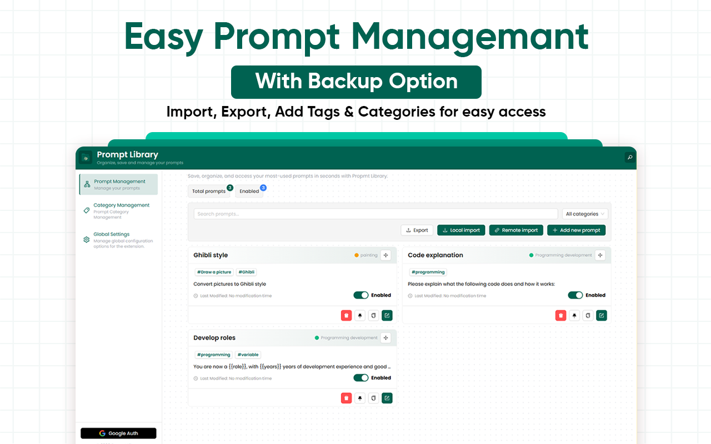

# Prompt Library

Save, organize, and access your most-used prompts in seconds with Prompt Library.

Prompt Library is a powerful browser extension focused on prompt management and quick input. It helps you create, manage, and organize a library of prompts, and lets you quickly insert preset prompt content into any input field on a webpage — significantly improving your efficiency when interacting with AI tools.

---

## 

## 🔥 Core Features

- 📚 Convenient Prompt Management: Easily create, edit, and manage your prompt library
- ⚡ Quick Input: Trigger the prompt selector quickly in any input field by typing /p
- 🎯 Multiple Quick Actions:
- ⌨️ Use keyboard shortcut (Ctrl+Shift+P / Command+Shift+P) to open the prompt selector
- 💾 Use shortcut (Ctrl+Shift+S / Command+Shift+S) to quickly save selected text as a prompt
- 🖱️ Right-click menu to save selected text directly as a prompt

- 🔧 Customizable Prompts: Set title, content, and tags for each prompt for easy categorization and search
- 💼 Data Backup: Support for exporting and importing your prompt library, making cross-device migration and backups easy
- 🔍 Smart Search: Quickly search and filter prompts
- 🌓 Adaptive Theme: Automatically adjusts to your system's light or dark mode

---

## 🎬 Use Cases

- 🤖 AI Assistant Interaction: Quickly input frequently used prompts to improve communication efficiency
- 📋 Text Editing: Save commonly used text templates for easy reuse
- 💡 Content Creation: Organize and manage creative prompts to inspire ideas anytime
- ⏱️ Work Efficiency: Create templates for repetitive text input to save time

---

## 📦 Installation

### From Source (Developer Mode)

1. Clone or download this repository
2. Open `chrome://extensions/` in your browser
3. Enable **Developer Mode** (toggle at top-right)
4. Click **"Load Unpacked"**
5. Select the folder where this extension’s code lives

---

## 🔧 Usage

1. Open [ChatGPT](https://chat.openai.com/)
2. Click the extension icon or activate the UI panel
3. Use checkboxes to select chats
4. Click **Delete** or **Archive** from the action bar

---

## 🛡️ Permissions

This extension only requests permissions required to:

- Access tabs
- Modify the DOM to inject UI elements
- Store archive states in local storage (optional)

We do **not** track, store, or transmit any of your data externally.

---

# Useful Links

- [Manage Console ID](https://console.cloud.google.com/apis/credentials?project=chrome-extension-463213)
